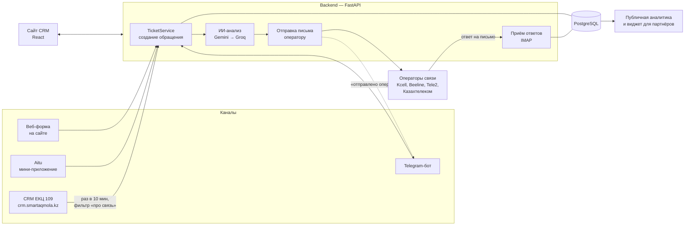

# Smart Aqmola CRM — как устроена система

Документ для разработчиков: что делает система, откуда берутся
обращения, что с ними происходит и где это лежит в коде. Как
запустить проект — в [CONTRIBUTING.md](../CONTRIBUTING.md).

Содержание:

1. [Что это и кто пользуется](#1-что-это-и-кто-пользуется)
2. [Общая схема](#2-общая-схема)
3. [Структура кода](#3-структура-кода)
4. [Роли и права](#4-роли-и-права)
5. [Обращение: поля и жизненный цикл](#5-обращение-поля-и-жизненный-цикл)
6. [Каналы приёма](#6-каналы-приёма)
7. [ИИ-анализ](#7-ии-анализ)
8. [Письма операторам связи](#8-письма-операторам-связи)
9. [Ответы: входящие письма и Telegram](#9-ответы-входящие-письма-и-telegram)
10. [Аналитика, отчёты, публичный виджет](#10-аналитика-отчёты-публичный-виджет)
11. [Пользователи и безопасность](#11-пользователи-и-безопасность)
12. [Фоновые задачи](#12-фоновые-задачи)
13. [Frontend](#13-frontend)
14. [База данных и миграции](#14-база-данных-и-миграции)
15. [Настройки (.env)](#15-настройки-env)
16. [Боевой сервер](#16-боевой-сервер)
17. [Особенности и техдолг](#17-особенности-и-техдолг)
18. [Рецепты: как добавить…](#18-рецепты-как-добавить)

---

## 1. Что это и кто пользуется

CRM акимата Акмолинской области для обращений жителей **по качеству
мобильной связи и интернета**: нет связи в селе, медленный интернет,
обрыв линии, проблемы с SIM-картой, биллингом и т.п.

Задача системы — принять обращение из любого канала, разобрать его
(ИИ определяет категорию, оператора связи, приоритет, пишет черновик
письма), **переслать оператору связи** (Kcell, Beeline, Tele2,
Казахтелеком), принять ответ оператора и довести обращение до
закрытия. Плюс аналитика для руководства.

**Кто пользуется:**

| Роль | Кто это | Что делает |
| --- | --- | --- |
| Администратор | руководитель / ответственный в акимате | всё: обращения, сотрудники, жители, операторы рассылки, назначение исполнителей |
| Специалист | сотрудник, обрабатывающий обращения | работает с обращениями, отвечает жителям, переотправляет письма |
| Пользователь | житель | регистрируется сам, подаёт обращения, видит только свои |

---

## 2. Общая схема



Все каналы сходятся в **одну точку** — `TicketService.create_ticket()`.
Поэтому обращение из бота, Aitu или ЕКЦ проходит ровно тот же путь
(ИИ, модерация, письмо), что и с веб-формы.

---

## 3. Структура кода

```
backend/
  app/
    main.py              — запуск FastAPI, CORS, подключение роутеров,
                           фоновые задачи, виджет (/widget.js, /widget-api)
    telegram_bot.py      — Telegram-бот (диалог подачи обращения)
    database.py          — подключение к PostgreSQL (SQLAlchemy)
    routers/             — HTTP-адреса API: принимают запрос, проверяют
                           права, вызывают сервис. Логики здесь мало.
    services/            — бизнес-логика: что происходит с обращением
    repositories/        — запросы к базе (без логики)
    models/              — таблицы базы (SQLAlchemy)
    schemas/             — формы данных API (Pydantic): что принимаем
                           и что отдаём, валидация полей
    core/                — общее: роли, пароли/JWT, шифрование полей,
                           ограничение частоты запросов, папка загрузок
    static/widget.js     — встраиваемый виджет аналитики для партнёров
  alembic/versions/      — миграции базы
  seed_admin.py          — роли + первый admin (запускается при старте)
  seed_demo.py           — тестовые данные (только разработка)
  entrypoint.sh          — старт контейнера: ждём базу → миграции →
                           seed_admin → uvicorn

frontend/src/
  App.jsx                — маршруты, шапка, боковое меню по ролям
  pages/                 — страницы
  components/            — графики, таблица обращений, карта, модалки
  context/               — общее состояние: вход, язык, список обращений
  api/                   — запросы к backend (axios)
  i18n/translations.js   — все тексты интерфейса на ru и kz
  data/akmolaDistricts.js— районы области (для карты/форм)
```

**Как проходит запрос** (пример — изменить статус обращения):

```
PATCH /tickets/42
  → routers/tickets.py        update_ticket()       проверка входа (JWT)
  → services/ticket_service.py update_ticket()      права, бизнес-правила
  → repositories/ticket_repository.py update()       запись в базу
  → schemas/ticket.py         TicketResponse         что вернуть фронту
```

Правило: **логика — в `services/`**, а не в роутерах и не во фронте.
Проверки прав дублируются на backend, даже если кнопка во фронте
скрыта (иначе их можно обойти прямым запросом к API).

---

## 4. Роли и права

Названия ролей — в `backend/app/core/roles.py`. Роли создаёт
`seed_admin.py`. Проверки — зависимости в `routers/auth.py`:
`get_current_user` (вошёл ли), `require_roles(...)`, `require_staff`
(Администратор или Специалист), плюс проверки внутри сервисов.

| Действие | Админ | Специалист | Житель |
| --- | :-: | :-: | :-: |
| Видеть обращения | все | все | только свои |
| Создать обращение | ✔ | ✔ | ✔ |
| Менять статус, приоритет, категорию, район | ✔ | ✔ | — |
| Назначать исполнителя | ✔ | — | — |
| Переотправить письмо, переанализировать ИИ | ✔ | ✔ | — |
| Ответить жителю в Telegram | ✔ | ✔ | — |
| Удалить обращение | ✔ | ✔ | — |
| Комментарии к обращению | ✔ | ✔ | своим |
| Входящие письма | ✔ | ✔ | — |
| Операторы рассылки | изменять | смотреть | смотреть |
| Сотрудники, жители (`/users`) | изменять | смотреть | — |
| Аналитика (без персональных данных) | ✔ | ✔ | ✔ |
| Отчёт PDF/Excel | ✔ | ✔ | — |

Чужое обращение для жителя отдаётся как **404, а не 403** — чтобы не
подтверждать, что обращение с таким номером вообще существует.

Меню во фронте строится по `user.role_name` в `App.jsx` — это только
удобство, защита на backend.

---

## 5. Обращение: поля и жизненный цикл

Модель — `backend/app/models/ticket.py`, таблица `tickets`.

| Группа | Поля | Комментарий |
| --- | --- | --- |
| Заявитель | `applicant`, `phone` | **зашифрованы** в базе (см. §11) |
| Суть | `description`, `district`, `source` | `source`: Веб-форма / Telegram-бот / Aitu / Внешняя CRM |
| Разбор | `category`, `operator`, `priority` | итоговые значения, правит сотрудник |
| Работа | `status`, `assigned_user_id`, `deadline` | статусы: **Новое → В работе → Закрыто**; `deadline` пока не используется |
| Происхождение | `created_by_user_id`, `telegram_chat_id`, `external_reference` | кто создал; чат бота для ответа; номер в ЕКЦ 109 |
| ИИ | `ai_category`, `ai_operator`, `ai_priority`, `ai_summary`, `ai_confidence`, `ai_draft_letter`, `ai_is_meaningful`, `ai_contains_profanity`, `ai_moderation_reason`, `ai_processed` | что предложил ИИ (хранится отдельно от итоговых полей) |
| Письмо | `email_sent`, `email_recipient`, `email_operator_id`, `email_error` | ушло ли письмо, кому, и **почему не ушло** |
| Даты | `created_date`, `created_at`, `updated_at` | |

Связанные таблицы: `ticket_attachments` (фото), `ticket_comments`
(комментарии), `incoming_emails` (ответы операторов).

### Создание обращения

`TicketService.create_ticket()` — `services/ticket_service.py`:

```mermaid
sequenceDiagram
    participant К as Канал (сайт/бот/Aitu/ЕКЦ)
    participant S as TicketService
    participant AI as ai_service
    participant M as email_service
    participant О as Оператор связи

    К->>S: create_ticket(данные, автор)
    Note over S: житель не может задать статус,<br/>исполнителя, приоритет — сбрасываются
    S->>S: сохранить в базу (status = «Новое»)
    S->>AI: analyze_ticket(текст, список специалистов)
    AI-->>S: категория, оператор, приоритет, резюме,<br/>черновик письма, модерация
    Note over S: пустые category/operator заполняются из ИИ;<br/>у жителей приоритет всегда от ИИ;<br/>исполнитель — если ИИ предложил и он не назначен
    S->>S: можно ли отправлять автоматически?
    alt есть причина не отправлять
        S->>S: email_sent=false, email_error=причина
    else можно
        S->>M: send_ticket_notification()
        M->>О: письмо «Smart Aqmola: обращение №N — …»
        S->>S: email_sent=true, email_recipient
        S-->>К: (если из бота) «✅ отправлено оператору»
    end
```

### Когда письмо НЕ уходит автоматически

`_get_autosend_block_reason()` — обращение всё равно создаётся, но
письмо ждёт ручной проверки; причина пишется в `email_error`:

1. С одного аккаунта за сегодня больше **20** обращений
   (`MAX_AUTO_SEND_TICKETS_PER_DAY`) — защита Gmail-ящика от спам-блока.
   Для бота/Aitu/ЕКЦ это общий служебный аккаунт.
2. ИИ-анализ не выполнился (сбой сети/сервиса) — текст не проверен.
3. ИИ нашёл нецензурную лексику.
4. ИИ посчитал текст бессодержательным (спам, пустая отписка, не по теме).
5. При отправке: не найден оператор в «Операторах рассылки» или ошибка
   SMTP — тоже `email_sent=false` с текстом ошибки.

Сотрудник видит причину в карточке и может **отправить вручную**
(`POST /tickets/{id}/send-email`, можно выбрать другого оператора
или вписать адрес) или **переанализировать**
(`POST /tickets/{id}/analyze`). Если письмо не ушло именно из-за
сбоя ИИ, а повторный анализ прошёл успешно — письмо уходит само.

### Изменение

`PATCH /tickets/{id}` → `update_ticket()`: только сотрудники;
исполнителя (`assigned_user_id`) меняет только администратор. Меняются
только переданные поля.

---

## 6. Каналы приёма

| Канал | Где код | Как приходит | Автор в базе |
| --- | --- | --- | --- |
| Веб-форма | `routers/tickets.py` `POST /tickets` | вошедший пользователь или сотрудник | сам пользователь |
| Telegram-бот | `app/telegram_bot.py` | диалог в боте | служебный `telegram_bot` |
| Aitu | `routers/aitu.py` `POST /aitu/tickets` | публичная форма без входа, лимит **10 обращений в час с IP** | служебный аккаунт Aitu |
| ЕКЦ 109 | `services/external_crm_sync.py` | забор раз в **10 минут** | служебный `external_crm_sync` |

**Служебные аккаунты.** Бот, Aitu и синхронизация создают обращения от
имени технических пользователей с ролью «Пользователь» — функции
`_get_or_create_*_account()`. Так у каждого обращения всегда есть
автор, и работает лимит 20 писем в сутки.

**Telegram-бот** (`telegram_bot.py`, библиотека python-telegram-bot):
- при первом контакте спрашивает имя, при первом обращении — телефон;
  профиль хранится по `chat_id` в таблице `telegram_users`;
- меню: «Составить обращение», «Изменить имя», «Изменить телефон»,
  «Язык / Тіл» (ru/kz);
- подача: район → оператор → фото (необязательно, несколько) → текст;
- фото сохраняются в `backend/uploads` и видны в карточке;
- на боевом сервере бот работает **внутри процесса backend**
  (`RUN_BOT_IN_BACKEND=true`), поэтому в нём нельзя блокировать event
  loop долгими синхронными вызовами;
- отдельно бота можно запустить: `python -m app.telegram_bot`.

**ЕКЦ 109 (crm.smartaqmola.kz):**
- забираем список обращений, по каждому — карточку
  (`/api/appeals/{id}/`), потому что текст есть только в карточке;
- **двойной фильтр «про связь»**: по названию категории и по тексту
  (`services/telecom_filter.py` — список основ слов: «связ», «интернет»,
  «вышк», названия операторов, казахские «байланыс», «желі»…). Нужен
  потому что токен пока видит **все** категории их CRM;
- повторно не импортируем: номер их обращения хранится в
  `external_reference` (уникальный);
- без телефона или текста обращение пропускается;
- выключатель: `EXTERNAL_CRM_SYNC_ENABLED=false` (в разработке
  выключено всегда).

---

## 7. ИИ-анализ

`services/ai_service.py`, функция `analyze_ticket(description, specialists)`.

- **Основной** — Google Gemini (`GEMINI_API_KEY`, модель
  `GEMINI_MODEL`), ответ строго по Pydantic-схеме `TicketAnalysis`.
- **Резерв** — Groq (`GROQ_API_KEY`), если Gemini не ответил
  (например, 503). Тот же промпт + «верни строго JSON».
- Ошибка → `AIAnalysisError`, обращение сохраняется без разбора,
  `ai_processed=false`, письмо не уходит автоматически.

Что возвращает ИИ: `category`, `operator`, `priority`,
`assigned_user_id` (из списка активных специалистов), `summary`,
`confidence` (0–1), `draft_letter`, `is_meaningful`,
`contains_profanity`, `moderation_reason`.

Справочники — константы в начале `ai_service.py`:
- `CATEGORIES`: Плохое качество связи, Нет доступа к интернету,
  Медленный интернет, Обрыв линии / авария, Проблема с SIM-картой,
  Тарификация и биллинг, Иное;
- `OPERATORS`: Kcell, Beeline, Tele2, Казахтелеком, Другое / не указан;
- `PRIORITIES`: Низкий, Средний, Высокий.

Правила в промпте: Altel → Tele2, Activ → Kcell; черновик письма —
деловой стиль, «Уважаемые коллеги,», **без подписи** (письмо уходит
как есть; подпись дополнительно вырезается `_strip_letter_signature`).

**Меняете справочник** — проверьте, где он ещё используется:
фронтенд-фильтры и графики, `telecom_filter.py`, бот (кнопки
операторов), аналитика.

---

## 8. Письма операторам связи

`services/email_service.py` + страница «Операторы рассылки».

- Отправка через **Gmail SMTP** (`GMAIL_ADDRESS`, `GMAIL_APP_PASSWORD` —
  пароль приложения, не обычный пароль).
- Кому: по полю `ticket.operator`, если пусто — `ticket.ai_operator`.
  Адреса берутся из таблицы `email_operators` (страница «Операторы
  рассылки»): на каждого оператора основной адрес + дополнительные
  (копии получают все). Совпадение названий — без учёта регистра.
- Тема: `Smart Aqmola: обращение №{id} — …` — **номер в теме важен**:
  по нему привязываются ответы (см. §9).
- Тело: данные обращения + черновик письма от ИИ; фото — вложениями.
- Ручная отправка может указать другого оператора (`operator_id`) или
  любой адрес (`manual_email`).

Через тот же SMTP отправляются коды подтверждения при регистрации.

---

## 9. Ответы: входящие письма и Telegram

**Входящие письма** — `services/incoming_email_service.py`:
- каждые **2 минуты** забираем новые письма из того же Gmail по IMAP
  (плюс кнопка «Проверить почту» на странице «Входящие письма»);
- ищем в теме `№<число>` → привязываем к обращению; нет номера —
  письмо сохраняется без привязки и видно в общем списке;
- из текста вырезается цитата исходного письма (`_strip_quoted_reply`);
- если обращение из бота — житель получает уведомление в Telegram;
- таблица `incoming_emails`, `message_id` защищает от дублей.

**Ответ жителю в Telegram** — `POST /tickets/{id}/telegram-reply`:
сотрудник пишет текст и/или прикладывает фото в карточке, сообщение
уходит в тот же чат (`telegram_chat_id`). Только для обращений из бота.
Отправка — `services/telegram_notify.py` (простые HTTP-запросы к
Telegram API, без библиотеки бота).

---

## 10. Аналитика, отчёты, публичный виджет

| Что | Адрес | Доступ | Данные |
| --- | --- | --- | --- |
| Аналитика в кабинете | `GET /tickets/analytics-summary` | любой вошедший | по всем обращениям, **без ФИО и телефонов** (схема `TicketAnalyticsItem`) |
| Публичная аналитика | `GET /public/analytics-summary` | без входа | то же самое |
| Виджет для сайтов-партнёров | `/widget.js` + `/widget-api/...` | без входа, CORS `*` только для `/widget-api` | то же самое |
| Отчёт | `GET /tickets/report?date_from&date_to&format=pdf\|xlsx` | сотрудники | сводка и разбивки |

`TicketAnalyticsItem` — поля: статус, район, категория (ИИ), оператор,
дата, отправлено ли письмо. Если добавляете поле в аналитику —
добавляйте в эту схему и **никогда** не кладите туда персональные данные:
она открыта всем.

Графики считаются **на фронте** из этого списка
(`pages/Analytics.jsx`, `components/*Chart.jsx`).

Отчёты — `services/report_service.py`: PDF (reportlab, шрифт DejaVu
для кириллицы в `app/assets/`) и Excel (openpyxl).

Виджет (`app/static/widget.js`) партнёр вставляет одним тегом:
`<div id="smart-aqmola-widget"></div><script src="https://…/widget.js"></script>`.
Отдельное FastAPI-приложение `/widget-api` нужно, чтобы открыть CORS
только для него, не трогая основной API.

---

## 11. Пользователи и безопасность

**Регистрация жителя** (`routers/auth.py`, `services/user_service.py`):
1. `POST /auth/register/send-code` — код из 6 цифр на почту; повтор не
   чаще раза в **60 с**, код живёт **10 минут**, **5 попыток** ввода;
2. `POST /auth/register` — данные + код → аккаунт с ролью «Пользователь».

Пароль (`schemas/auth.py`): от 8 символов, заглавная и строчная буква,
цифра, спецсимвол. Хранится хешем Argon2 (`core/security.py`).

**Вход** — `POST /auth/login` → JWT (`JWT_SECRET_KEY`, срок
`JWT_ACCESS_TOKEN_EXPIRE_MINUTES`, по умолчанию 8 часов). Фронт хранит
токен в `localStorage` и шлёт в заголовке `Authorization: Bearer …`.
`GET /auth/me` — кто я.

Защита от подбора:
- **5** неверных паролей подряд → аккаунт заблокирован на **15 минут**
  (поля `failed_login_attempts`, `locked_until` у пользователя);
- больше **20** попыток входа с одного IP за 15 минут → отказ
  (`core/rate_limit.py`, хранится в памяти процесса).

Сотрудников и других жителей создаёт администратор на страницах
«Сотрудники» и «Пользователи» (`/users`).

**Шифрование персональных данных.** `applicant` и `phone` в таблице
`tickets` — тип `EncryptedString` (`core/db_types.py`,
`core/encryption.py`, Fernet, ключ `FIELD_ENCRYPTION_KEY`). Шифрование
и расшифровка прозрачны: в коде это обычные строки. Следствия:
- **искать/фильтровать по ФИО и телефону в SQL нельзя** — в базе
  шифротекст;
- без ключа (локально) данные пишутся открытым текстом — это нормально
  для разработки;
- ключ на проде менять нельзя — старые записи станут нечитаемыми.

---

## 12. Фоновые задачи

Запускаются в `main.py` при старте (`@app.on_event("startup")`):

| Задача | Интервал | Выключается |
| --- | --- | --- |
| Забор входящих писем (IMAP) | 2 мин | нет почтовых настроек → просто пишет предупреждение |
| Синхронизация с ЕКЦ 109 | 10 мин | `EXTERNAL_CRM_SYNC_ENABLED=false` или нет URL/токена |
| Telegram-бот | постоянно | `RUN_BOT_IN_BACKEND` не `true` |

Синхронные вызовы (IMAP, HTTP) запускаются через
`asyncio.to_thread`, чтобы не тормозить API и бота.

---

## 13. Frontend

React + Vite, без UI-библиотек, свои SVG-иконки
(`components/icons.jsx`), карты — Leaflet, Excel — `xlsx`.

**Состояние (`context/`):**
- `AuthContext` — пользователь и токен (`localStorage.token`), вход/выход;
- `TicketContext` — список обращений и действия с ними (создать,
  изменить, удалить, переанализировать, переотправить письмо) —
  страницы берут данные отсюда, а не грузят каждая сама;
- `LanguageContext` — язык ru/kz, функция `t("ключ")`.

**Запросы (`api/`):** `api.js` — общий axios-клиент: адрес API
(`config.js`: `VITE_API_URL` или «тот же хост, порт 8000»), токен,
понятный текст ошибок FastAPI/Pydantic. Остальные файлы — функции по
разделам (`ticketApi.js`, `userApi.js`…).

**Тексты** — только через `t("ключ")`, ключи в
`i18n/translations.js`, всегда в двух языках.

**Страницы (`pages/`):**

| Страница | Адрес | Кому | Что |
| --- | --- | --- | --- |
| Dashboard | `/` | все | последние обращения + карта покрытия |
| Tickets | `/tickets` | все (житель — свои) | список с фильтрами, создание |
| TicketDetails | `/tickets/:id` | все (житель — свои) | карточка: ИИ-разбор, письмо, фото, комментарии, ответ в Telegram, входящие письма |
| Analytics | `/analytics` | все | графики, отчёты PDF/Excel |
| Users | `/users` | админ | жители |
| Staff | `/staff` | админ | сотрудники |
| EmailOperators | `/email-operators` | админ | адреса операторов связи для писем |
| IncomingEmails | `/incoming-emails` | админ, специалист | ответы операторов |
| Cybersecurity, NationalProjects | `/cybersecurity`, `/national-projects` | все | информационные страницы |
| Login, Register | `/login`, `/register` | без входа | вход, регистрация с кодом |
| PublicAnalytics | `/public-analytics` | без входа | публичная аналитика (тёмная/светлая тема) |
| AituForm | `/aitu` | без входа | форма для мини-приложения Aitu |

---

## 14. База данных и миграции

PostgreSQL, SQLAlchemy 2, миграции — Alembic.

| Таблица | Что |
| --- | --- |
| `roles`, `users` | роли и учётные записи (сотрудники, жители, служебные) |
| `tickets` | обращения |
| `ticket_attachments` | фото к обращениям (файлы в `backend/uploads`) |
| `ticket_comments` | комментарии |
| `email_operators` | адреса операторов связи для рассылки |
| `incoming_emails` | входящие письма (ответы операторов) |
| `telegram_users` | профили жителей в боте (имя, телефон, язык, район) |
| `email_verification_codes` | коды подтверждения при регистрации |

**Миграции.** При каждом старте backend выполняет `alembic upgrade
head` (`entrypoint.sh`). Изменили модель → создайте миграцию:

```bash
docker compose -f docker-compose.dev.yml exec backend alembic revision --autogenerate -m "что изменилось"
```

Проверьте сгенерированный файл глазами (autogenerate ошибается,
например, с переименованиями) и закоммитьте вместе с моделью.
Миграции в этом проекте пишутся **идемпотентно** — проверяют, есть ли
уже колонка/таблица (`sa.inspect`), — чтобы повторный запуск не падал.

---

## 15. Настройки (.env)

| Переменная | Зачем | Локально |
| --- | --- | --- |
| `DB_*` / `DATABASE_URL` | база | задаёт `docker-compose.dev.yml` |
| `JWT_SECRET_KEY` | подпись токенов входа | любая строка |
| `FIELD_ENCRYPTION_KEY` | шифрование ФИО/телефона | пусто |
| `GEMINI_API_KEY`, `GEMINI_MODEL` | ИИ | свой бесплатный ключ |
| `GROQ_API_KEY`, `GROQ_MODEL` | резервный ИИ | необязательно |
| `GMAIL_ADDRESS`, `GMAIL_APP_PASSWORD` | письма и входящая почта | свой тестовый Gmail |
| `TELEGRAM_BOT_TOKEN`, `RUN_BOT_IN_BACKEND` | бот | свой тестовый бот |
| `EXTERNAL_CRM_API_URL`, `EXTERNAL_CRM_API_TOKEN`, `EXTERNAL_CRM_SYNC_ENABLED` | ЕКЦ 109 | выключено |
| `EXTRA_ALLOWED_ORIGINS` | CORS для адреса фронта на проде | не нужно |
| `VITE_API_URL` (frontend) | адрес API, если фронт и API на разных адресах | не нужно |

---

## 16. Боевой сервер

Render.com, автодеплой из ветки `main` основного репозитория (не этого):
backend (`crm-project-6wdg`, Docker) и frontend
(`crm-project-frontend-3etk`) — раздельно, база — PostgreSQL на Render.
Отдельно на собственном сервере акимата работает статическая форма
Aitu. Практиканты к боевому окружению доступа не имеют — изменения
переносит руководитель после ревью.

---

## 17. Особенности и техдолг

Что стоит знать, чтобы не удивляться (и что можно улучшать):

- **SSL в Docker.** `ai_service.py` при `DOCKER_ENV=1` ослабляет проверку
  сертификатов — обход для сетей с антивирусом/прокси, подменяющим
  сертификаты. Это не образец для копирования.
- **Ограничение частоты (rate limit) в памяти процесса** — сбрасывается
  при перезапуске и не работает между несколькими экземплярами сервера.
- **`deadline`** у обращений есть в базе и в API, но нигде не заполняется.
- **Всё в одном процессе** на проде: API + бот + фоновые задачи —
  тяжёлая синхронная операция тормозит всё сразу.
- **Список обращений** грузится целиком (`TicketContext`) — при росте
  базы понадобится пагинация на backend.
- **Поиск по ФИО/телефону** только на фронте — в базе они зашифрованы.
- Формат API ЕКЦ 109 подтверждён частично — код написан с запасными
  вариантами полей (см. комментарий в `external_crm_sync.py`).

---

## 18. Рецепты: как добавить…

**Новое поле в обращение**
1. `models/ticket.py` — колонка.
2. Миграция Alembic (идемпотентная).
3. `schemas/ticket.py` — в `TicketCreate`/`TicketUpdate`/`TicketResponse`
   по смыслу (персональные данные — **не** в `TicketAnalyticsItem`).
4. Если поле заполняется автоматически — в `ticket_service.py`.
5. Фронт: `TicketDetails.jsx`, при необходимости `TicketTable.jsx`;
   тексты — в `translations.js` (ru + kz).

**Новый адрес API**
1. Функция в нужном `services/*.py` (логика и проверки прав).
2. Маршрут в `routers/*.py` с правильной зависимостью доступа
   (`get_current_user` / `require_staff` / `require_roles`).
3. Схемы ответа в `schemas/`.
4. Проверить в http://localhost:8000/docs.
5. Функция-обёртка в `frontend/src/api/*.js`.

**Новую страницу**
1. `frontend/src/pages/Название.jsx` (+ `Название.css` при необходимости).
2. Маршрут и пункт меню в `App.jsx` — с проверкой роли, как у соседних.
3. Тексты — в `translations.js`.

**Новую категорию / оператора связи**
`ai_service.py` (`CATEGORIES` / `OPERATORS`) → бот (кнопки операторов) →
`telecom_filter.py` (ключевые слова) → «Операторы рассылки» (адрес) →
фильтры и графики на фронте.
